# 🚀 Welcome to My Digital Universe! 

<div align="center">
  
</div>

---

## 🌟 About Me

```python
class Developer:
    def __init__(self):
        self.name = "Evans Ampofo Torddey"
        self.role = "Software Developer & Cloud Engineer"
        self.languages = ["Python", "JavaScript", "TypeScript"]
        self.cloud_platforms = ["AWS", "Docker", "Kubernetes"]
        self.passions = ["Machine Learning", "Cloud Architecture", "Full-Stack Development"]
        self.current_focus = "Building scalable cloud solutions"
    
    def get_motto(self):
        return "Code Is Creative"
```

---

## 🛠️ Tech Arsenal

<div align="center">

### ☁️ Cloud & Backend


### 🎨 Frontend & Frameworks


### 🤖 AI & Machine Learning


</div>

---

## 📊 GitHub Analytics

<div align="center">
  
  
</div>

<div align="center">
  
</div>

---

## 🏗️ Architecture Philosophy

```mermaid
graph TB
    A[☁️ Cloud-First Design] --> B[🔧 Microservices]
    B --> C[📊 Data-Driven Decisions]
    C --> D[🚀 Scalable Solutions]
    D --> E[🔒 Security by Design]
    E --> F[♻️ Sustainable Code]
    F --> A
```



---

## 🎯 Current Mission

- 🌱 **Growing:** Advanced AWS certifications and DevOps practices
- 🔭 **Building:** Intelligent cloud-native applications
- 🤝 **Collaborating:** Open source ML tools and React components
- 💡 **Exploring:** Serverless architectures and edge computing

---

## 🌈 Fun Facts

```javascript
const myLife = {
    codeEditor: "VS Code with 20+ extensions",
    debuggingMusic: ["Lo-fi Hip Hop", "Afrobeats", "Classical"],
    favoriteAWSService: "Lambda (because serverless is life)",
    currentlyReading: "Cloud Engineering books",
    hobbies: ["Cloud architecture", "ML experiments", "Building side projects"]
};
```

---

## 📫 Let's Connect!

<div align="center">
  
[](https://www.linkedin.com/in/evans-torddey)
[](https://x.com/EvansTorddey)
[](mailto:ea.torddey@gmail.com)


</div>

---

<div align="center">
  
</div>

<div align="center">
  <h3>💭 "The best way to predict the future is to invent it." - Alan Kay</h3>
</div>

---

*⭐️ Evans Ampofo Torddey*